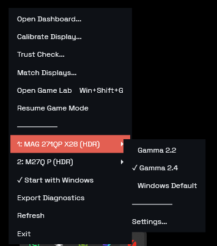
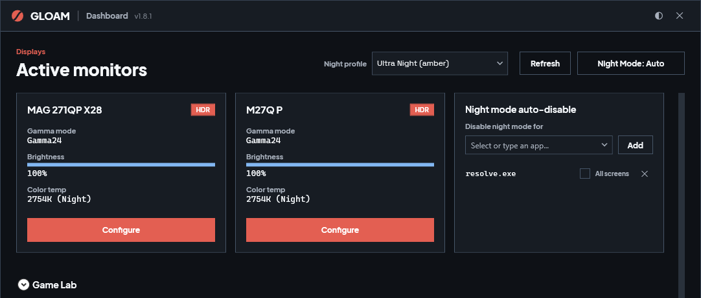
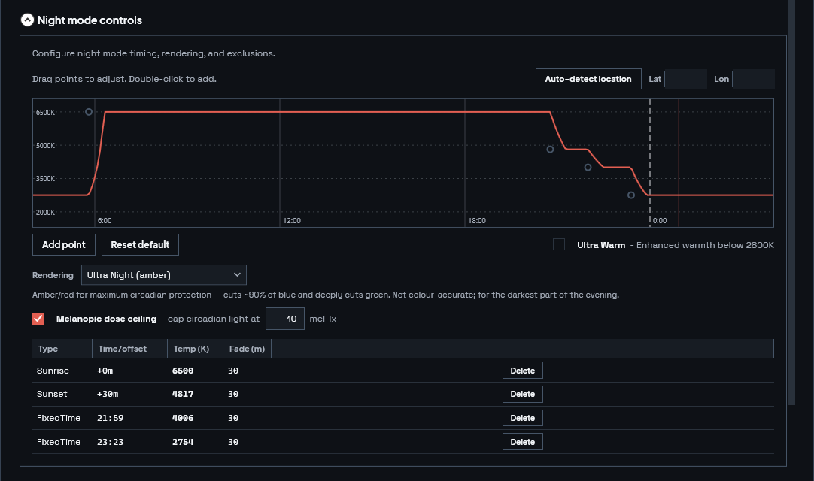
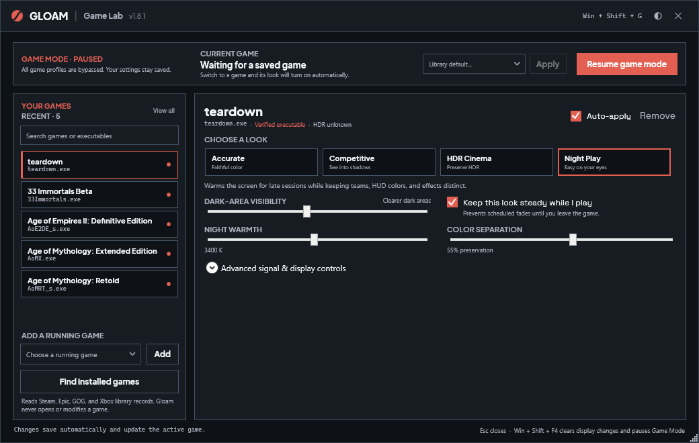
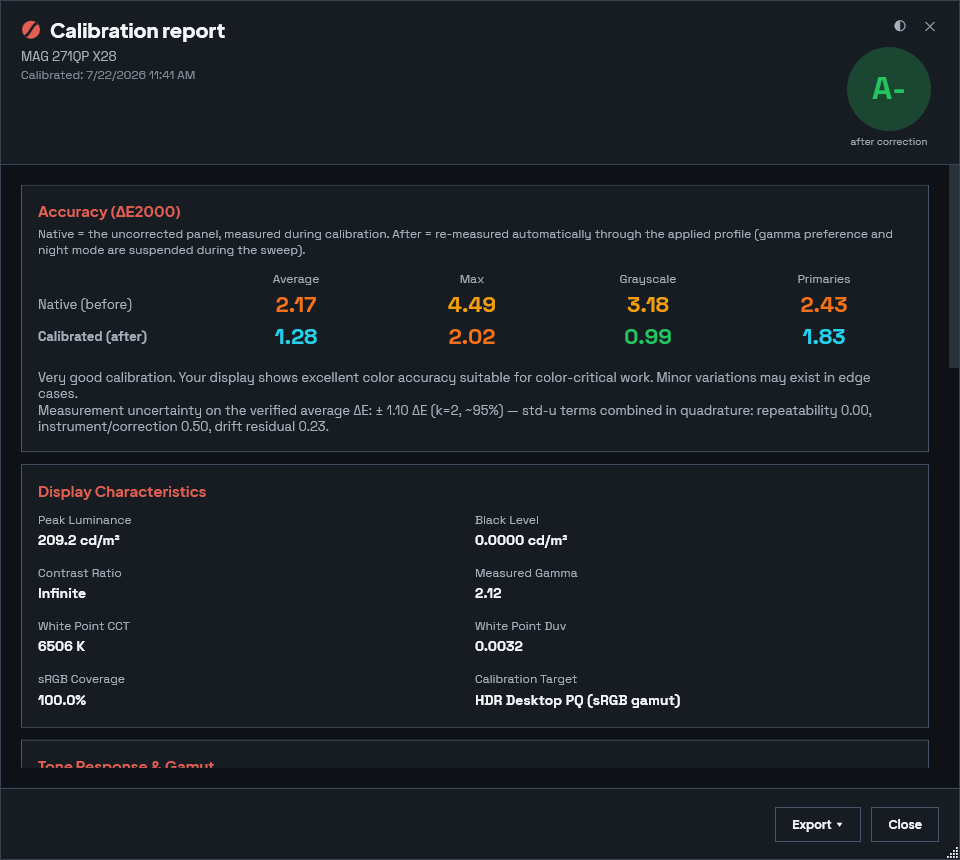

# Gloam

Fix washed-out SDR content in Windows HDR mode. Per-monitor gamma correction, a perceptual night mode, and verified colorimeter calibration.

[](https://github.com/halideworks/gloam/actions/workflows/build.yml)
[](https://github.com/halideworks/gloam/releases/latest)
[](LICENSE.txt)


<sub>Rendered, not photographed: the source image is pushed through the same signal path the app implements (`TransferFunctions.cs`, `LutGenerator.cs`, and the Windows SDR-in-HDR wire model), once without Gloam and once with its Gamma 2.2 LUT, then re-encoded for an ordinary SDR screen. See [`scripts/render-comparison-images.py`](scripts/render-comparison-images.py). A screenshot cannot show this: the whole problem is that what the compositor sends to the panel differs from what gets captured.</sub>

Turn HDR on in Windows and SDR content goes flat and milky, because Windows presents it through a curve your display was never built to decode. Gloam puts the right curve back, per monitor.

## Quick start

1. Download [`GloamApp-win-Setup.exe`](https://github.com/halideworks/gloam/releases/latest/download/GloamApp-win-Setup.exe) and run it. Per-user install, no administrator prompt.
2. Right-click the Gloam icon in the system tray.
3. Pick **Gamma 2.2** for the monitor you want to fix.

That is the whole fix. Everything below is optional.

## What It Does

- Fixes the Windows SDR-in-HDR gamma mismatch with per-monitor Gamma 2.2, Gamma 2.4, or Windows Default modes.
- Restores corrections automatically on startup, display changes, resume, and driver or game ramp resets.
- Provides a perceptual night mode built on CAT16 chromatic adaptation, with fixed-time or sun-position schedules, a manual override, perceptually uniform mired-space fades, and an Ultra Night profile for maximum blue suppression.
- Adds per-game Game Lab profiles with calibrated shadow visibility, Reference, Competitive Clarity, Cinematic HDR, and spectral Night Ops intents, multi-display window targeting, and a Gameplay Lock that holds schedule-derived output steady during play.
- Checks the Windows-visible game signal chain at launch, including SDR/HDR expectation, DXGI color space, output bit depth, HDR headroom, and measured-calibration status. The dashboard keeps a live receipt of the active intent and every finding.
- Auto-disables night mode for chosen applications while they are in the foreground, either on every monitor or only on the displays the application's window covers. Gamma correction and installed calibration profiles stay active.
- Supports SDR and HDR colorimeter calibration through ArgyllCMS, including native Windows MHC2 profile installation and verification.
- Remembers calibration setup per monitor, including target, preset, meter correction, display type, and window position.
- Updates silently in the background when installed with the setup package.
- Runs locally. No accounts, no telemetry.

## Install

These links always resolve to the current release:

Recommended:

- [`GloamApp-win-Setup.exe`](https://github.com/halideworks/gloam/releases/latest/download/GloamApp-win-Setup.exe)
- Per-user install, no administrator prompt.
- Self-contained.
- Bundles ArgyllCMS.
- Auto-updates silently on app exit or restart.

Portable:

- [`GloamApp-win-Portable.zip`](https://github.com/halideworks/gloam/releases/latest/download/GloamApp-win-Portable.zip)
- Extract and run `Gloam.exe`.
- Does not auto-update. Replace it with a newer zip to upgrade.

Release notes, checksums and older versions: https://github.com/halideworks/gloam/releases

If SmartScreen says "Windows protected your PC", click **More info** and confirm the verified publisher. New signed apps can still show reputation warnings until enough users have installed them.

## Use



1. Launch Gloam. It appears in the system tray.
2. Right-click the tray icon.
3. Pick a gamma mode per monitor:
   - Gamma 2.2 for general PC use.
   - Gamma 2.4 for dark-room video or BT.1886-style viewing.
   - Windows Default to bypass correction.
4. Enable **Start with Windows** if you want corrections restored at login.
5. Open the dashboard for monitor status, night mode, calibration, and diagnostics.

Something not behaving? See [Troubleshooting](docs/troubleshooting.md).



Hotkeys:

- `Win + Shift + F1`: Gamma 2.2 on the focused monitor.
- `Win + Shift + F2`: Gamma 2.4 on the focused monitor.
- `Win + Shift + F3`: Windows Default.
- `Win + Shift + F4`: Panic mode, clears gamma ramps immediately.
- `Win + Shift + N`: Toggle night mode.
- `Win + Shift + G`: Open or dismiss the dedicated Game Lab window for the active game.

## Night mode



Night mode warms the display on a schedule you set by fixed times or by sun position for your location. The shift is computed as a chromatic adaptation rather than a blue-channel cut, so neutrals stay neutral instead of going muddy, and transitions are paced in mired space so the change is perceptually even rather than fast at one end and slow at the other.

Ultra Night pushes further for maximum blue suppression, and can use a spectral sample of your own panel when you supply one.

## Game Lab



1. Press `Win + Shift + G` from a game to open the compact Game Lab window. The dashboard section remains available for desktop setup.
2. The foreground game's executable is prefilled. Running-game choices refresh while the window is open.
3. Add the game and choose a picture intent. Competitive Clarity lifts the deepest shadows while protecting midtones; Cinematic HDR preserves PQ and checks the Windows signal; Night Ops uses Gloam's spectral renderer.
4. Edits save and apply automatically. Toggle **Profile enabled** to compare the profile with the calibrated baseline.
5. Leave **Gameplay Lock** enabled to hold schedule-derived color temperature steady during the session. The panic and manual night-mode hotkeys remain authoritative.
6. The active-session receipt lists the gamma, shadow treatment, night policy, target display, and signal findings that Gloam can verify.

The implementation and measurement boundaries are documented in [Game Lab design](docs/gamer-mode-design.md).

## Calibration



Connect a supported colorimeter and choose **Calibrate Display** from the tray.

Recommended flow:

1. Warm up the display for at least 30 minutes.
2. Pick the monitor, display type, target, and calibration preset.
3. Use a matching `.ccss` or `.ccmx` correction for QD-OLED, wide-gamut LCD, and other non-standard panels. The setup dialog can search the DisplayCAL community database and download one directly.
4. Run calibration. Gloam bypasses existing corrections while measuring.
5. Review the report. Gloam applies the profile and re-measures through it automatically.

For HDR desktop calibration, use **HDR Desktop PQ (sRGB gamut)**. When a panel already measures close to target, prefer white-point-only correction over full gamut correction: correcting a panel that is already accurate reliably verifies worse, not better.

Every number in the report is measured through the installed profile, not predicted. The method, and what it does not claim, is written up in the [whitepaper](https://getgloam.org/whitepaper).

### Hardware validation

Gloam's calibration model is pinned by golden fixtures: real recorded measurement sets replayed through the live pipeline on every CI run, so a modeling change that would alter what the pipeline computes from real panel data fails the build.

- **Golden-fixture validated:** Gigabyte M27Q-P, MSI MAG271QPX28.
- **Expected to work, seeking validation data:** OLED, QD-OLED, wide-gamut LCD, mini-LED.

The second list is honest rather than modest. The code carries panel-specific handling for those classes, but no recorded fixture pins it. If you have one of those displays and a supported colorimeter, [contributing a golden fixture](docs/golden-fixture-contribution.md) is the single most valuable thing you can send us.

## Requirements

- Windows 10 or 11.
- HDR display for the main SDR-in-HDR gamma fix.
- No .NET runtime install required for official builds.
- Colorimeter optional. Calibration uses ArgyllCMS, which Gloam can download automatically.

## Build From Source

```powershell
git clone https://github.com/halideworks/gloam.git
cd gloam
dotnet run --project src/Gloam
```

Package locally:

```powershell
.\package.ps1 -Version X.Y.Z
```

Headless checks:

```powershell
dotnet run --project src/Gloam.Cli -- check-lut 2.2 200 --algorithm perceptual --temp-k 2700 --json artifacts\cli-lut-check.json
dotnet run --project src/Gloam.Cli -- night 2200 --algorithm ultra --basis rec2020 --json -
```

Contributions are welcome. See [CONTRIBUTING.md](CONTRIBUTING.md).

## Files

- Settings, logs, reports, corrections: `%LOCALAPPDATA%\Gloam`
- Velopack install root: `%LOCALAPPDATA%\GloamApp`

Use **Export Diagnostics** from the tray when reporting issues.

## License

Gloam is MIT licensed.

ArgyllCMS is AGPL v3. Gloam invokes ArgyllCMS tools as separate processes and does not link against AGPL code. See `THIRD_PARTY_NOTICES.txt`.

## Credits

Gloam began as a fork of Dylan Raga's [win11hdr-srgb-to-gamma2.2-icm](https://github.com/dylanraga/win11hdr-srgb-to-gamma2.2-icm) and retains his identification of the Windows SDR-in-HDR sRGB-to-gamma correction, the insight the whole application is built around. Gloam has since grown into a different program, but it started there, and that diagnosis was the hard part.

- [ArgyllCMS](https://www.argyllcms.com/), by Graeme Gill: the measurement and profiling tools Gloam drives for every calibration.
- [MHC2Gen](https://github.com/dantmnf/MHC2), by dantmnf: the reference for Windows MHC2 profile generation.

Formerly HDR Gamma Controller.
